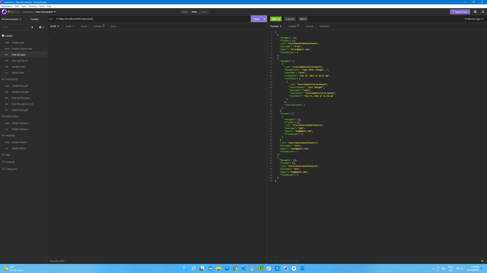

# Social Network API
  

  ## Description
  - This project is a backend API for a social network web application where    
    users are able to share their thoughts, add friends, react to friends’ thoughts.
  - This application was created by using `MongoDB, Express.js, and Mongoose`.

  ## Table of Contents
  * [Installation](#installation)
  * [Usage](#usage)
  * [License](#license)
  * [Contributing](#contributing)
  * [Tests](#tests)
  * [Demo](#demo)
  * [Screenshot](#screenshot)
  * [Questions](#questions)

  ## Installation

  - Download `node` , install  `express, mongoose, mongoDB` modules.
  - Make sure you have `MongoDB` installed in your local machine.

  ## Usage
  - Clone the repository.
  - Run `npm i` to install packages and then,
  - Run `npm start` to start the application.

  ## License
  This project is licensed under 

  ## Contributing
  N/A

  ## Tests
  - N/A

  ## Demo

  - API routes are tested through `Insomnia Core`

  - You can view walk through video by pressing [this link](https://drive.google.com/file/d/1eCfCFYzdRTm3qnJE1yDJhVWo8x4_l5DP/view) .

  ## Screenshot 

  
  

  ## Questions
  If you have any questions regarding the project you can contact me directly at artlil420@gmail.com.
  Please feel free to view more of my projects at https://github.com/Artur0705